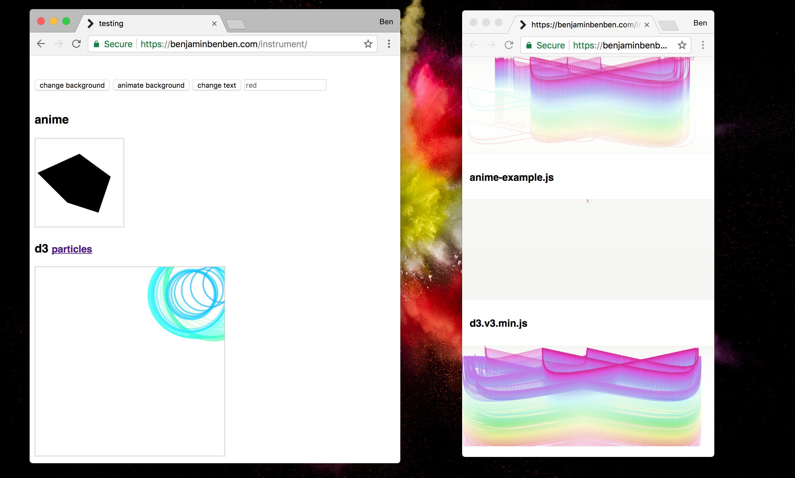

# instrument

This uses a service worker to instrument any JavaScript files, allowing you to view live calls as you're interacting with a page.

### Usage

1. copy `dist/instrument.js` into your project root
2. in a console, run: `navigator.serviceWorker.register('instrument.js', {scope: '/'})`
3. visit `instrument.html` (served from the SW) to see live code calls

